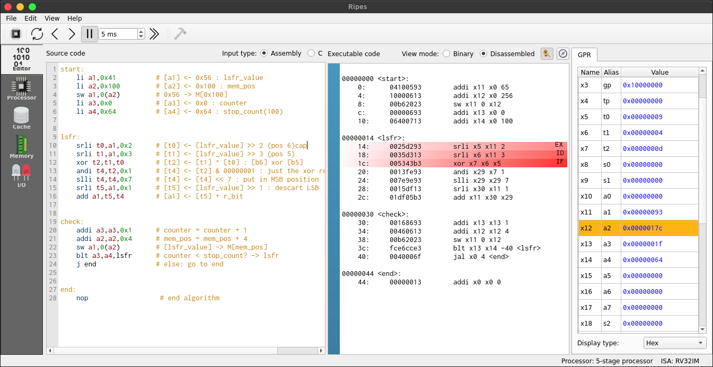
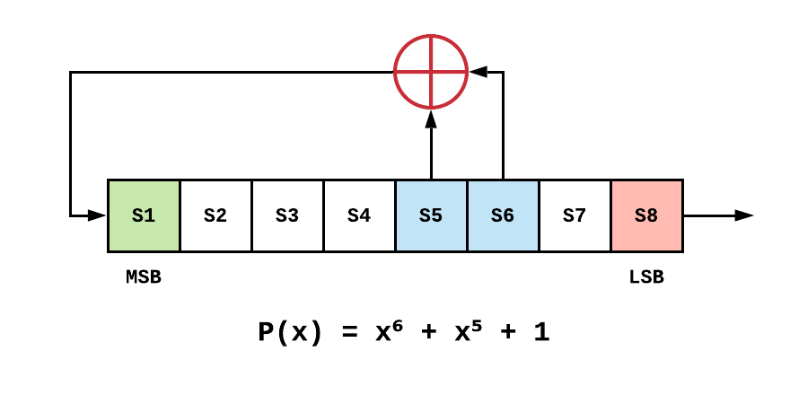

# CE4301 - Generador de números pseudo-aleatorios 🎲

Generador de números pseudo aleatorios utilizando el algoritmo _linear-feedback shift register_ (LFSR), en su variante fibonacci.

## Requisitos 📋

Para correr el código de ejemplo debe tener instalado en su computador un simulador de lenguaje ensamblador. Le recomendamos utilizar el simulador de procesador `RISC-V` : [Ripes](https://github.com/mortbopet/Ripes/releases).

El simulador Ripes se encuentra disponible para Windows, MacOS y Linux. Consulte las instrucciones de instalación [aquí](https://github.com/mortbopet/Ripes/blob/master/README.md).


## Primeros pasos 🚀

Para correr el programa:

1. Abra el simulador de `RISC-V` Ripes.
2. Para cargar el archivo `File > Load Program` y seleccione el archivo `lfsr_ealvarado_v2.s`.
3. En la pestaña **Editor** podrá revisar el código fuente. El valor de la semilla viene por defecto en `0x56` que es el ASCII de la letra _V_. Para cambiarlo coloque el valor de semilla que desee:

```gas:
start:
    li a1,<hex value>
```

4. Finalmente, corra el programa haciendo click en el **botón de play** que se ubica en la barra superior. Podrá ver los resultados en la tabla de registros o en la pestaña **Memory**.



## Algoritmo LFSR 💾

El generador LFSR tiene múltiples aplicaciones en criptografía, videojuegos, simulación y otros. El generador obtiene números en un orden secuencial aleatorio:

1. Se inicia con un valor semilla.
2. Se toman los bits de las posiciones (`tab`) dadas por el polinomio y se les aplica la operación `xor`.
3. Se realiza un `shift left` para descartar el `LSB`.
4. Se ingresa el bit resultante en la posición del `MSB`.


La implementación del código en C para 8 bits, utilizando el polinomio:


```c
// Código completo: lfsr_ealvarado_v2.c

void lfsr_fibonacci(void) {
    
    uint8_t seed_value = 0x56;  
    uint8_t lfsr_value = seed_value;
    uint8_t bit;    
    int counter = 0;

    do
    {   // taps: 6 5; feedback polynomial: x^6 + x^5 + 1 
        bit = ((lfsr_value >> 2) ^ (lfsr_value >> 3)) & 1;
        lfsr_value = (lfsr_value >> 1) | (bit << 7);
        counter++;
    }
    while (counter < 100);
    
    printf("result -> %d\n",lfsr_value);
}
```

El código en el archivo `lfsr_ealvarado_v2.s` implementa este algoritmo en ensamblador utilizando el set de instrucciones `RISC-V`.

## Autor 🖋

* **Esteban Alvarado** - *Software Developer* - [@estalvgs1999](https://github.com/estalvgs1999)

> Este proyecto fue desarrollado para el **curso CE4301 - Arquitectura de Computadores I** del Instituto Tecnológico de Costa Rica. 2021 🄯

Agradecimiento al profesor del curso:

* Prof. Luis Alberto Chavarría Zamora

----

<p align="center">

</p>
